# 🏗️ Project DR Architecture — Multi-Region AWS Disaster Recovery

This repository contains a **cost-aware two-region Disaster Recovery (DR) reference architecture on AWS** using CloudFormation.  
It showcases how to architect, deploy, and fail over a simple workload between regions in minutes — demonstrating **real-world RTO under 5 minutes**.

---

## ✨ Key Highlights

- 🧭 **Two-Region DR Reference:** Custom VPCs, EC2 Launch Templates, Auto Scaling Groups, and ALB with CloudFormation.
- 🪣 **S3 Cross-Region Replication:** Versioning, SSE, IAM replication role with least privilege.
- ⏱️ **<5 Min RTO:** Weighted Route 53 failover + ALB health checks.
- 📡 **CloudWatch + SNS:** Alarms for TG health, ASG availability, and CPU utilization.
- 🧠 **IaC Principles:** CloudFormation-first approach with a Terraform scaffold for portability.
- ☁️ **Cloud Pattern Mapping:** AWS to Azure/GCP equivalents for cross-cloud DR strategies.

---

## 🏗️ Architecture Overview

| Primary Region 🇨🇦 | Secondary Region 🇺🇸 |
|--------------------|-----------------------|
| `ca-central-1`     | `us-east-1`          |

**Core Components**  
- VPC, Subnets, ALB + ASG (NGINX “Hello from REGION”)  
- Route 53 DNS weighted failover  
- S3 Cross-Region Replication  
- CloudWatch + SNS alerts  
- IAM roles and replication permissions  
- CloudFormation templates for reproducibility  

---

## 📂 Folder Structure

Project-DR-Architecture/
├─ README.md
├─ diagrams/
│ └─ dr-architecture.drawio
├─ cloudformation/
│ ├─ primary-ca-central-1/
│ │ ├─ network.yaml
│ │ ├─ compute.yaml
│ │ └─ s3-primary.yaml
│ ├─ secondary-us-east-1/
│ │ ├─ network.yaml
│ │ ├─ compute.yaml
│ │ └─ s3-secondary.yaml
│ └─ global/
│ ├─ route53-failover.yaml
│ └─ sns-alarms.yaml
├─ user-data/
│ └─ nginx-bootstrap.sh
├─ runbooks/
│ ├─ 01-deploy.md
│ ├─ 02-failover-test.md
│ ├─ 03-rollback-cleanup.md
│ └─ 04-alarms-and-screenshots.md
├─ terraform-prototype/
│ └─ main.tf
└─ scripts/
├─ deploy_primary.sh
├─ deploy_secondary.sh
├─ setup_replication.sh
└─ teardown.sh

yaml
Copy code

---

## 📊 DR Failover Demo — Route 53 + ALB

| Step | Description                                | Screenshot |
|------|--------------------------------------------|------------|
| 1️⃣ | Initial DNS points to primary (ca-central-1) | 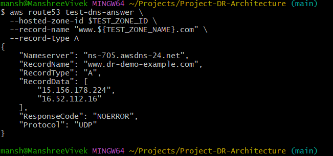 |
| 2️⃣ | Primary ALB returns 200 OK                  | 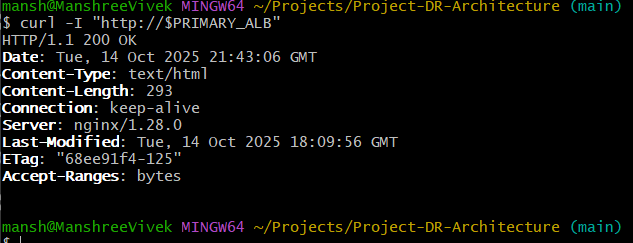 |
| 3️⃣ | Route 53 switches to secondary (us-east-1)  | 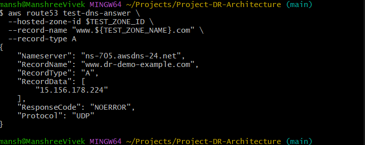 |
| 4️⃣ | Secondary ALB returns 200 OK               | 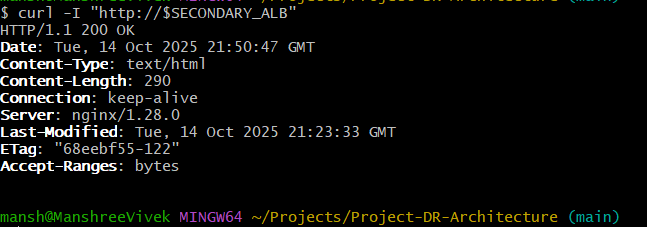 |

---

## 🏗️ Infrastructure Build — Step by Step

| Step | Description                                   | Screenshot |
|------|-----------------------------------------------|------------|
| 🧱 | Primary VPC + subnets deployed successfully   | 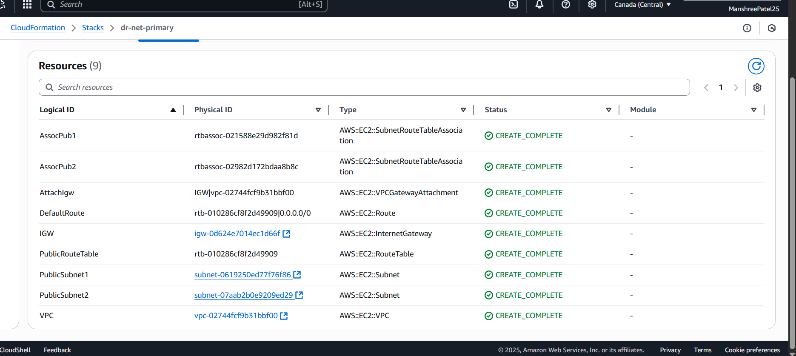 |
| 🧱 | Secondary VPC + subnets deployed              | 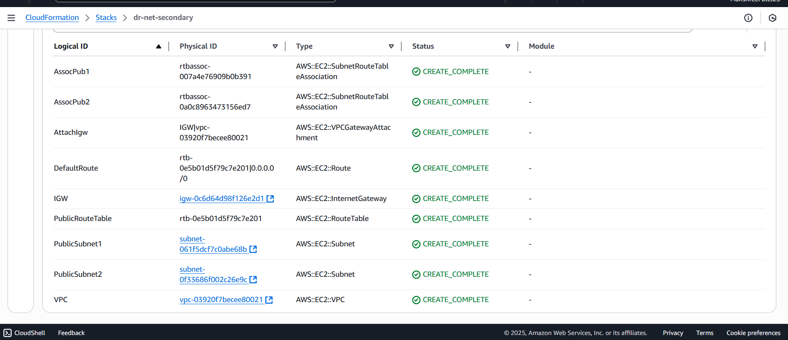 |
| 🖥️ | Primary ALB + ASG stack completed             | 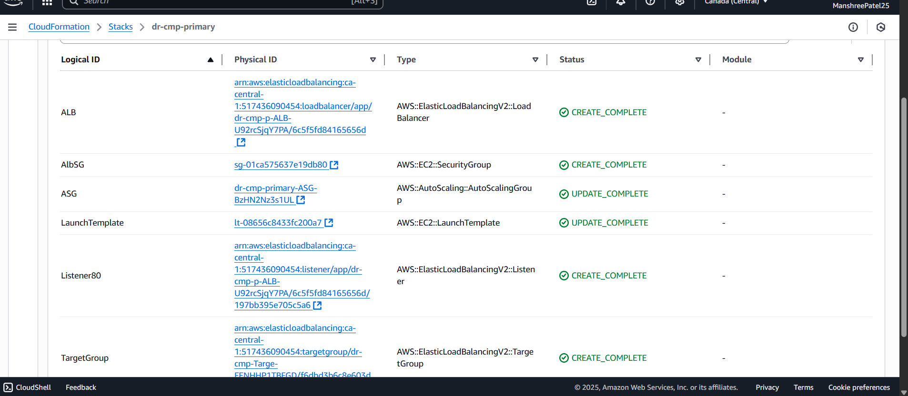 |
| 🖥️ | Secondary ALB + ASG stack completed           | 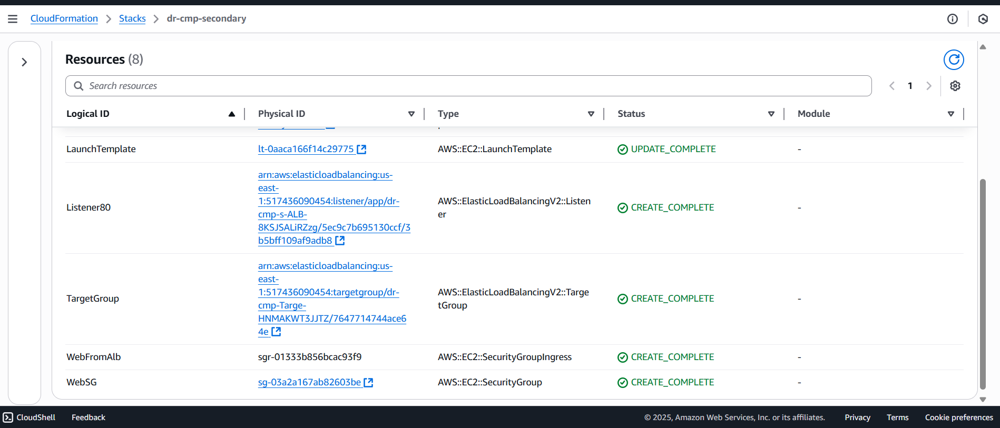 |
| 🌐 | Route 53 hosted zone with weighted alias      | 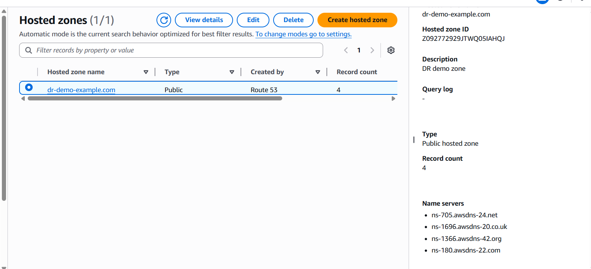 |
| 🌐 | DNS initially pointing to primary ALB | 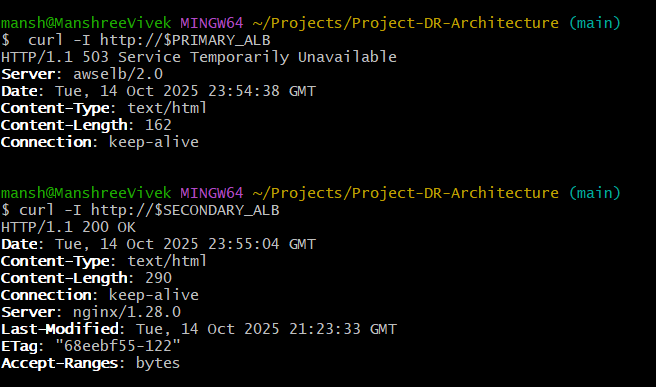 |


---

## 🪣 S3 Cross-Region Replication

| Step | Description                                     | Screenshot |
|------|-------------------------------------------------|------------|
| 🪣 | Primary S3 bucket — versioning + encryption on  | 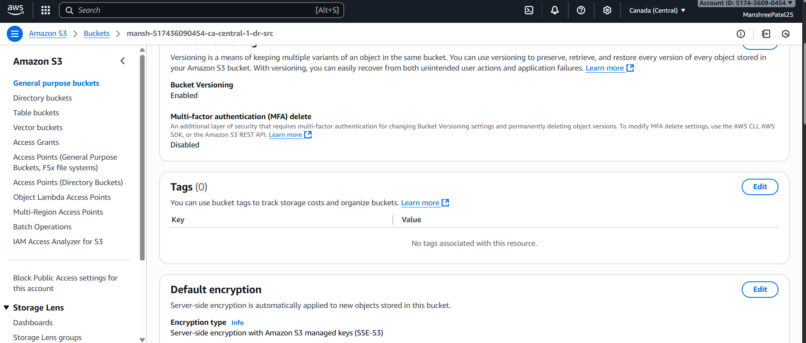 |
| 🪣 | Secondary S3 bucket — destination configured   | 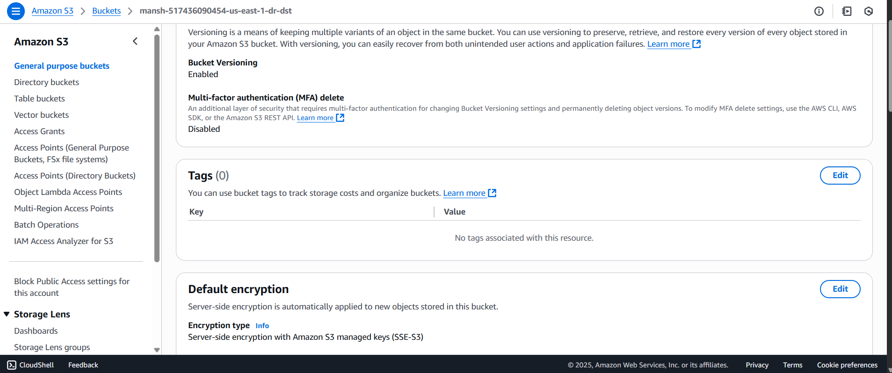 |
| 🪣 | Object successfully replicated across regions | 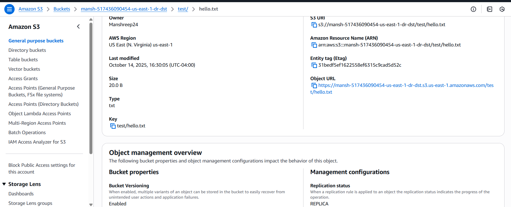 |

---

## 🛰️ Route 53 DR Failover Test (RTO < 5 min)

| Step | Description                                    | Screenshot |
|------|-----------------------------------------------|------------|
| 🛑 | TG health check failure simulated               | 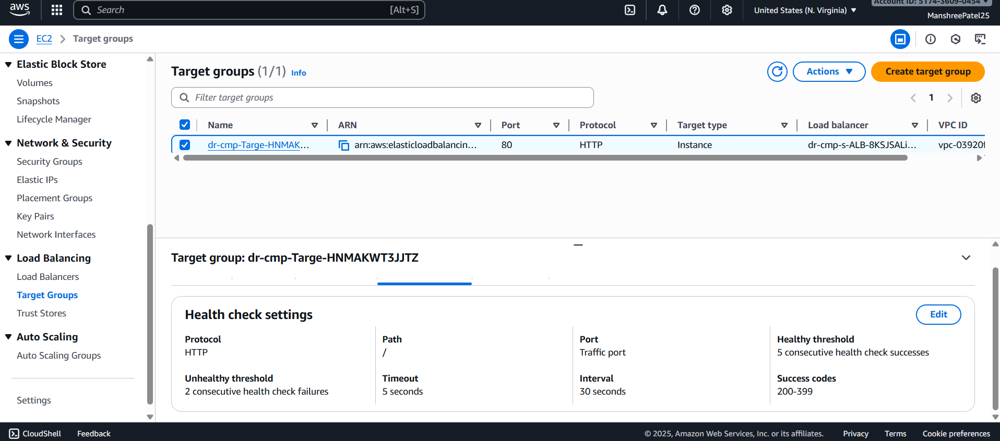 |
| 🔁 | DNS switches to secondary automatically        |  |

---

## 📡 CloudWatch Alarms & SNS Notifications

| Event | Description                        | Screenshot |
|-------|------------------------------------|------------|
| 🚨 | Target Group alarm fired             | 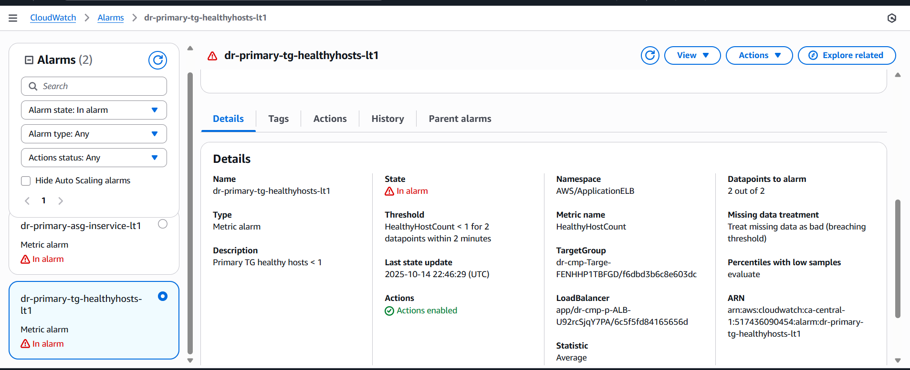 |
| 🚨 | ASG InService alarm fired            | 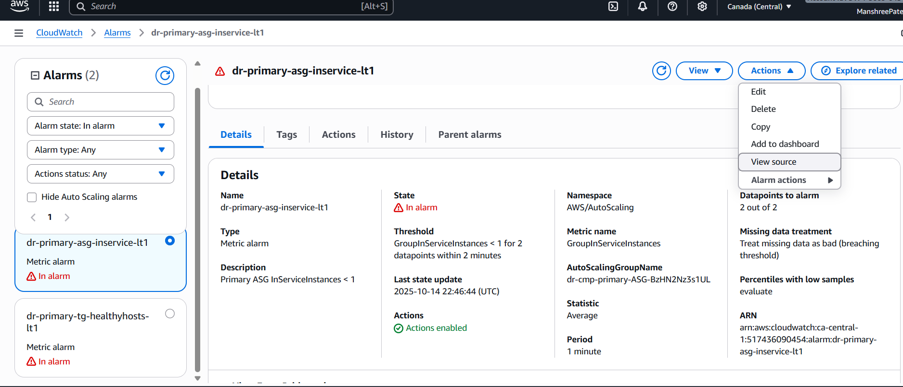 |
| ✉️ | Email notification received         | 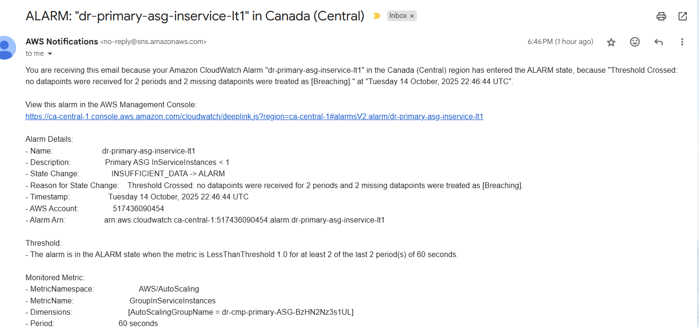|

✅ Failover succeeded in under **5 minutes** without any manual DNS changes.

---

## 🎥 Demo Video

📽️ Watch the live failover:  
[▶️ AWS DR Failover Demo (1:30)](https://github.com/Manshree-cloud/Project-DR-Architecture/raw/main/docs/aws-dr-failover-demo.mp4)

---

## 📘 Runbooks

- [01 — Initial DR Environment Deployment](runbooks/01-deploy.md)
- [02 — Route 53 Failover Drill](runbooks/02-failover-test.md)
- [03 — Rollback to Primary and Cleanup](runbooks/03-rollback-cleanup.md)
- [04 — Alarms and Evidence Capture](runbooks/04-alarms-and-screenshots.md)


## 🧹 Cleanup (Cost Control)

```bash
aws cloudformation delete-stack --stack-name dr-cmp-primary --region ca-central-1
aws cloudformation delete-stack --stack-name dr-cmp-secondary --region us-east-1
aws cloudformation delete-stack --stack-name dr-net-primary --region ca-central-1
aws cloudformation delete-stack --stack-name dr-net-secondary --region us-east-1
aws s3 rb s3://<primary-bucket> --force
aws s3 rb s3://<secondary-bucket> --force
👩‍💻 Author
Manshree Patel
AWS Certified Solutions Architect – Associate
Cloud & Platform Engineer | Event-driven Architectures | DR & HA Patterns

🌐 GitHub • ☁️ AWS Community Builder (in progress)

🛡️ “Resilience isn’t optional. It’s engineered.” — Multi-Region DR, Automated.

---

